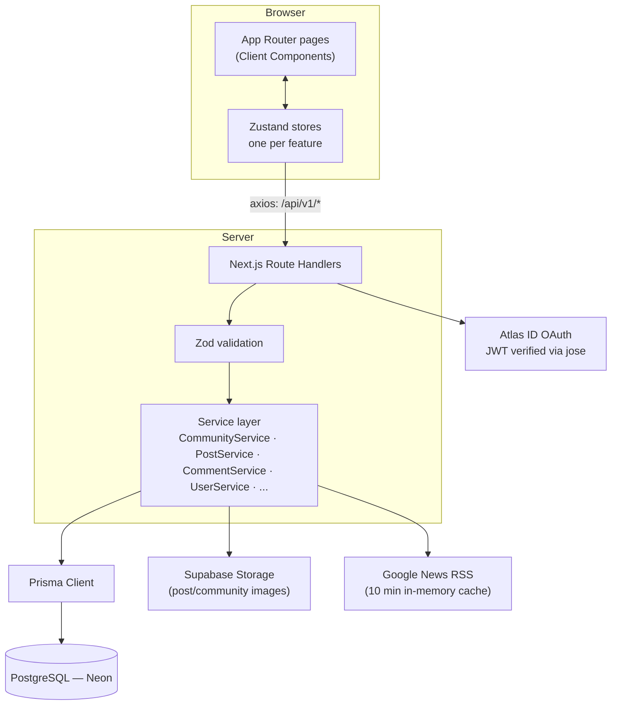
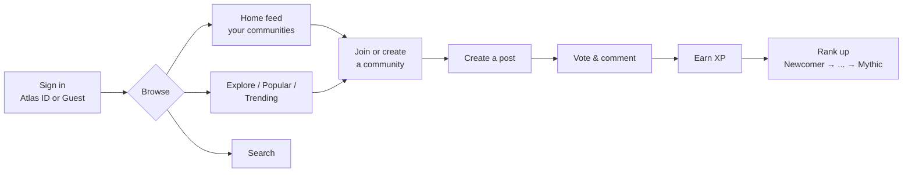
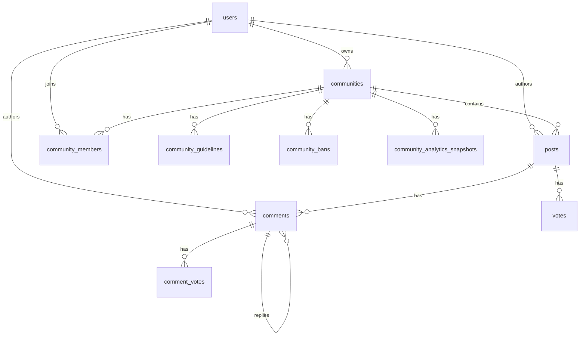

# Connexus

**Communities, built for real connections.**

Connexus is a Reddit-style community platform — create or join communities, post, discuss in nested threads, vote, and level up through an XP/rank system as you contribute. Built on Next.js 16 (App Router) with a fully typed API layer backed by Prisma + PostgreSQL.

---

## Features

**Communities**
- Public or private communities with Owner / Moderator / Member roles
- Join, leave, invite-to-private, ban/unban
- Member-editable guidelines
- Live + historical analytics dashboard for owners/moderators

**Posts & comments**
- Text and image posts, sorted by Hot / Top / Recent / Most Viewed
- Nested, threaded comments with independent voting
- View and share counters, pagination

**Discovery**
- Personalized home feed (your communities)
- Sitewide **Popular** feed
- **Explore**: Trending Today + Communities to Explore (popular communities you haven't joined)
- Cross-entity search (posts, communities, users)
- **What's Happening** — live world news pulled from Google News, no API key required

**Gamification**
- XP for posting, commenting, voting, and creating communities
- An 8-tier rank ladder (Newcomer → Contributor → Explorer → Pathfinder → Trailblazer → Luminary → Legend → Mythic), each with its own color, shown as a badge with progress to the next rank

**Accounts**
- Sign in via Atlas ID (OAuth) or continue as a guest
- Editable public profile (avatar, display name, bio) with post history and rank

---

## Architecture



### Core user flow



### Data model



Full schema lives in [`prisma/schema.prisma`](prisma/schema.prisma).

---

## Tech stack

| Layer | Choice |
|---|---|
| Framework | Next.js 16 (App Router, Turbopack) |
| Language | TypeScript |
| Styling | Tailwind CSS v4 |
| Client state | Zustand |
| Database | PostgreSQL (Neon serverless) |
| ORM | Prisma |
| Auth | Atlas ID OAuth, JWT verification via `jose` |
| File storage | Supabase Storage |
| Validation | Zod |
| Icons | Lucide |

---

## Project structure

```
src/
├── app/
│   ├── (shell)/              # Pages sharing the TopBar + SideBar layout
│   │   ├── c/[slug]/         # Community page
│   │   ├── u/[username]/     # Profile page
│   │   ├── p/[id]/           # Post detail page
│   │   ├── explore/  popular/  news/  settings/  create/  create-community/
│   │   └── about/  help/  support/
│   ├── api/v1/                # Route handlers (thin — validate, call a service, respond)
│   └── page.tsx                # Home feed
├── features/                   # One folder per feature: components/ + store/
│   ├── auth/ home/ community/ post/ profile/ sidebar/ popular/ create/ create-community/
├── server/
│   ├── schemas/                # Zod input schemas
│   ├── services/                # Business logic + Prisma queries
│   ├── types/                   # Response DTOs shared with the client
│   └── utils/                   # rank.ts, hotScore.ts, response helpers
├── shared/
│   ├── components/ui/           # Button, Modal, Avatar, Badge, RankBadge, ...
│   └── components/layout/       # TopBar, SideBar, RightSidePanel
└── infra/                       # Prisma client, Supabase client
```

---

## Getting started

### Prerequisites
- Node.js 20+
- A PostgreSQL database (this project targets [Neon](https://neon.tech))
- A Supabase project (for image storage)
- An Atlas ID OAuth client (for sign-in)

### Setup

```bash
npm install
```

Create a `.env` file with:

| Variable | Purpose |
|---|---|
| `DATABASE_URL` | Pooled Postgres connection string (Prisma) |
| `DIRECT_URL` | Direct Postgres connection string (migrations) |
| `JWT_PUBLIC_KEY` | Public key used to verify Atlas ID access tokens |
| `NEXT_PUBLIC_AUTH_URL` | Atlas ID auth service base URL |
| `NEXT_PUBLIC_CLIENT_ID` | Atlas ID OAuth client ID |
| `NEXT_PUBLIC_API_URL` | Base URL this app's own API is served from |
| `NEXT_PUBLIC_SUPABASE_URL` | Supabase project URL |
| `NEXT_PUBLIC_SUPABASE_PUBLISHABLE_KEY` | Supabase publishable key |
| `SUPABASE_SECRET_KEY` | Supabase service key (server-side uploads only) |

```bash
npm run db:generate   # generate the Prisma client
npm run db:migrate    # apply migrations
npm run dev            # start the dev server
```

Open [http://localhost:3000](http://localhost:3000).

### Scripts

| Command | Description |
|---|---|
| `npm run dev` | Start the dev server (Turbopack) |
| `npm run build` | Generate Prisma client + production build |
| `npm run start` | Start the production server |
| `npm run lint` | Run ESLint |
| `npm run db:migrate` | Run Prisma migrations |
| `npm run db:studio` | Open Prisma Studio |

---

## API

All endpoints live under `/api/v1` and follow a thin route → Zod validation → service → Prisma pattern. Highlights:

| Resource | Endpoints |
|---|---|
| Communities | `GET/POST /communities`, `GET/PATCH /communities/:slug`, `POST .../join`, `DELETE .../leave`, `GET/POST .../members`, `GET/PUT .../guidelines`, `GET/POST .../bans`, `GET .../analytics`, `GET /communities/trending`, `GET /communities/explore` |
| Posts | `GET/POST /posts` (scopes: `home`, `popular`, `community`, `user`), `GET/DELETE /posts/:id`, `POST .../vote`, `.../view`, `.../share` |
| Comments | `GET /posts/:id/comments`, `POST /comments`, `DELETE /comments/:id`, `POST /comments/:id/vote` |
| Users | `GET/PATCH /users/me`, `GET /users/me/score`, `GET /users/:username` |
| Search / News | `GET /search`, `GET /news` |

---

This is a private project — no license is published.
