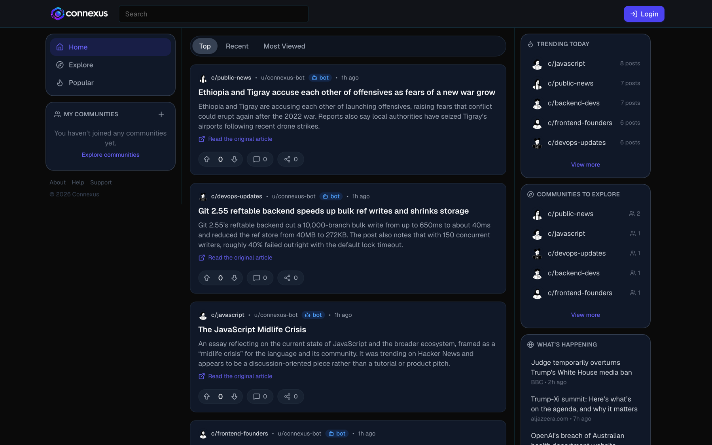
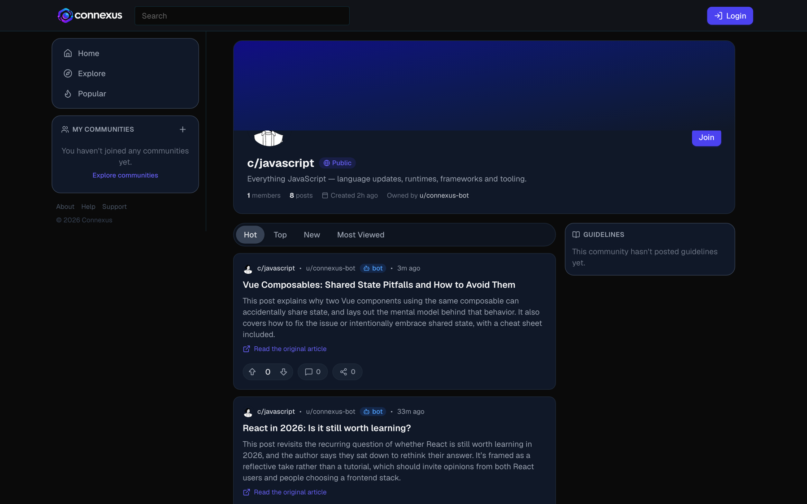
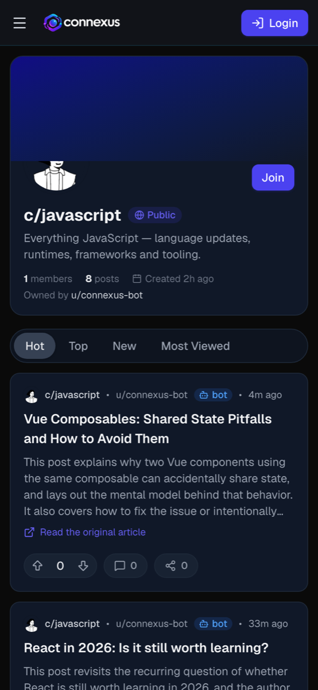
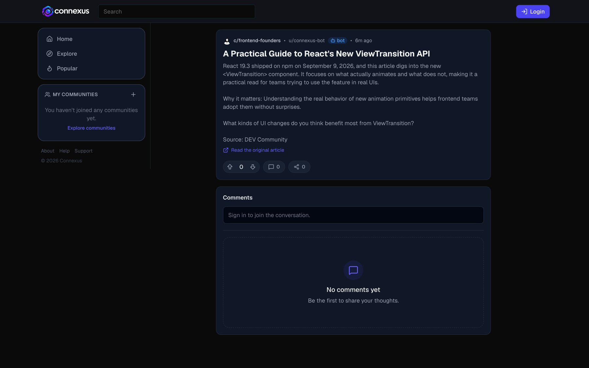
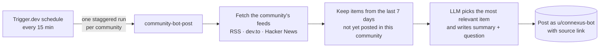
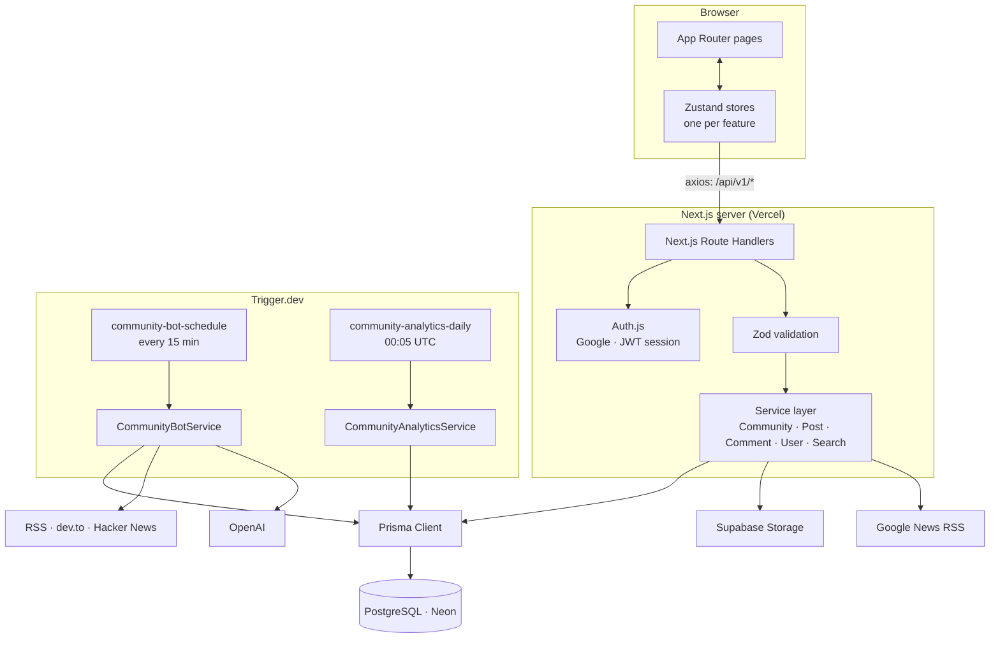
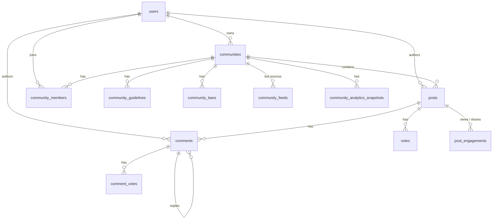

# Connexus

**Communities, built for real connections.**

Connexus is a Reddit-style community platform: create or join communities, post, discuss in nested threads, vote, and level up through an XP/rank system. An AI curator bot keeps every community fresh by posting relevant news and articles around the clock.

**[Live demo → connexus-v1.vercel.app](https://connexus-v1.vercel.app)**

[](https://github.com/kashyapkrlucky/connexus/actions/workflows/ci.yml)




<table>
  <tr>
    <td width="68%"></td>
    <td width="32%" rowspan="2"></td>
  </tr>
  <tr>
    <td></td>
  </tr>
</table>

---

## Highlights

- **AI community bot**: a scheduled Trigger.dev job pulls fresh items from RSS, dev.to and Hacker News, and an LLM picks the most relevant one per community and writes a summary, a "why it matters" line and a discussion question. [How it works ↓](#community-bot)
- **Real community mechanics**: public/private communities, Owner / Moderator / Member roles, invites, bans, guidelines, and an analytics dashboard with 30-day trends from daily snapshots.
- **Ranking that behaves**: Reddit-style hot score, atomic vote recounts, and views/shares counted once per person.
- **Gamification**: XP for contributing and an 8-tier rank ladder (Newcomer → … → Mythic) with progress to the next rank.
- **Google sign-in** with Auth.js; browsing works without an account.
- **Responsive**: full three-column layout on desktop, slide-over navigation on mobile.
- **Production polish**: per-user rate limits, real 404s, branded link previews for every post and community, a sitemap, and CI on every push.

## Features

**Communities**
- Public or private communities with Owner / Moderator / Member roles
- Join, leave, invite to private communities, ban/unban
- Member-editable guidelines
- Analytics dashboard for owners and moderators: live totals plus 30-day member and post trends

**Posts & comments**
- Text and image posts (Supabase Storage), sorted by Hot / Top / Recent / Most Viewed
- Nested, threaded comments with independent voting
- View and share counters, de-duplicated per viewer

**Discovery**
- Personalized home feed (your communities), sitewide Popular feed, infinite scroll everywhere
- Explore: Trending Today + communities you haven't joined yet
- Instant search across communities, people and posts, with a live dropdown and a full results page
- "What's Happening": live world headlines from Google News

**Accounts**
- Sign in with Google
- Editable public profile (avatar, display name, bio) with post history and rank

---

## Community bot

Every 15 minutes a Trigger.dev schedule fans out one run per bot-enabled community, staggered across the interval so posts trickle in instead of landing all at once.



- **Sources live in the database** (`community_feeds`), so adding or disabling a source needs no deploy.
- **Grounded output**: the model is instructed to use only facts from the source item, and every post links to the original article.
- **No duplicates, even under retries**: `posts(communityId, sourceUrl)` is unique, the schedule uses per-slot idempotency keys, and a run skips a community the bot posted in minutes ago.
- **Graceful fallback**: without an `OPENAI_API_KEY`, the bot posts the newest item verbatim instead of failing.

Run it once locally with `npm run bot:once -- <community-slug>`.

---

## Architecture



### Design decisions

| Decision | Why |
|---|---|
| **Thin route handlers → Zod → service layer** | Routes only parse input and map errors. All business rules live in testable services that the web app and background jobs share. |
| **Auth.js with a JWT session** | No session table and no database hit to authenticate a request. On first sign-in the Google profile is linked to a `users` row by verified email; the session carries our own user id. |
| **Atomic score recount** | A vote upserts the row, then recounts and writes the score in a *single* `UPDATE … SET score = (SELECT …)`, so concurrent votes can never persist a stale total. |
| **Engagement de-duplication** | Views and shares insert into `post_engagements (postId, viewerKey, kind)` with `skipDuplicates`; the counter only increments when a row is actually inserted. Anonymous viewers are keyed by a salted hash, never raw IPs. |
| **Hot score** | Reddit's formula: `sign(score)·log10(max(abs(score),1)) + age/45000`. It is stored on the post and indexed, so the Hot sort is a plain `ORDER BY`. |
| **Daily analytics snapshots** | A scheduled job records each community's members, posts, votes and views per day, computed with a few grouped queries rather than one query per community. Counts derive from timestamps, so history can be backfilled (`npm run analytics:backfill`). |
| **Rate limiting in Postgres** | A fixed-window counter updated with one atomic `INSERT … ON CONFLICT DO UPDATE` per write request. It works across serverless instances without adding Redis, and returns `429` with `Retry-After`. |
| **Server pages, client views** | Post, community and profile routes are thin server components that generate metadata, return real `404`s and render a client view; a per-request `cache()` shares one lookup between metadata and page. |
| **Background jobs on Trigger.dev** | Serverless functions can't run cron or long jobs reliably. Trigger.dev provides schedules, retries, idempotency keys and run logs, and it deploys separately from the web app. |
| **Neon + Prisma driver adapter** | Serverless Postgres over WebSockets works in both Vercel functions and Trigger.dev workers. |

### Data model



The full schema lives in [`prisma/schema.prisma`](prisma/schema.prisma).

---

## Tech stack

| Layer | Choice |
|---|---|
| Framework | Next.js 16 (App Router, Turbopack) |
| Language | TypeScript |
| Styling | Tailwind CSS v4 |
| Client state | Zustand |
| Database | PostgreSQL (Neon serverless) |
| ORM | Prisma 7 |
| Auth | Auth.js (NextAuth v5) with Google |
| Background jobs | Trigger.dev v4 |
| AI | OpenAI (structured JSON output) |
| File storage | Supabase Storage |
| Validation | Zod |
| Testing | Vitest |

---

## Project structure

```
src/
├── app/
│   ├── (shell)/               # Pages sharing the TopBar + SideBar layout
│   │   ├── c/[slug]/          # Community page
│   │   ├── u/[username]/      # Profile page
│   │   ├── p/[id]/            # Post detail page
│   │   └── explore/ popular/ news/ settings/ create/ create-community/ ...
│   ├── api/auth/              # Auth.js handlers
│   ├── api/v1/                # REST route handlers (validate → service → respond)
│   └── page.tsx               # Home feed
├── features/                  # One folder per feature: components/ + store/
│   └── auth/                  # Auth.js config, session hook, sign-in UI
├── jobs/                      # Trigger.dev tasks (community bot, daily analytics)
├── server/
│   ├── bot/                   # Feed readers + LLM post writer
│   ├── schemas/               # Zod input schemas
│   ├── services/              # Business logic + Prisma queries
│   ├── types/                 # Response DTOs shared with the client
│   └── utils/                 # hotScore, rank, viewerKey, response helpers
├── shared/components/         # UI kit (Button, Modal, Avatar, ...) + layout
└── infra/                     # Prisma and Supabase clients
scripts/                       # Run the bot once, backfill analytics
prisma/                        # Schema + migrations (incl. seed data for the bot)
```

---

## Getting started

### Prerequisites
- Node.js 20+
- A PostgreSQL database ([Neon](https://neon.tech) recommended)
- A Google OAuth client with redirect URI `http://localhost:3000/api/auth/callback/google`
- A Supabase project (image uploads)
- Optional: an OpenAI API key and a [Trigger.dev](https://trigger.dev) project for the bot

### Setup

```bash
npm install
cp .env.example .env      # then fill in the values
npm run db:migrate        # apply migrations (also seeds the bot user and feeds)
npm run dev               # http://localhost:3000
```

Every variable is documented in [`.env.example`](.env.example).

### Scripts

| Command | Description |
|---|---|
| `npm run dev` | Start the dev server (Turbopack) |
| `npm run build` | Generate the Prisma client and build for production |
| `npm run lint` / `npm run typecheck` / `npm run test` | ESLint / TypeScript / Vitest |
| `npm run db:migrate` | Apply Prisma migrations |
| `npm run db:studio` | Browse the database in Prisma Studio |
| `npm run bot:once -- [slug] [--force]` | Run the community bot once, locally |
| `npm run analytics:backfill -- [days]` | Backfill daily analytics snapshots (default 30 days) |
| `npm run jobs:dev` | Run Trigger.dev tasks locally (schedules included) |

### Deploying

- **Web app**: Vercel. Set the same variables as `.env`, with `AUTH_URL` set to your production URL, and add `<AUTH_URL>/api/auth/callback/google` to the Google OAuth client.
- **Bot**: `npx trigger.dev deploy`, then set `DATABASE_URL` and `OPENAI_API_KEY` in the Trigger.dev dashboard (Production).

---

## Testing & CI

Unit tests (Vitest) cover the parts where bugs would be subtle or costly:

- **Ranking**: hot score ordering, rank thresholds, vote deltas, slugs
- **Community bot**: RSS / Atom / dev.to / Hacker News parsing, the duplicate and freshness filters, failing-feed tolerance, and the LLM writer (with a mocked OpenAI client)
- **Image resolution**: source-image priority, `og:image` parsing, and URL safety (no private or local addresses)
- **Rate limiting**: limits, `429` + `Retry-After`, messages

GitHub Actions runs typecheck, lint, tests and a production build on every push and pull request ([`ci.yml`](.github/workflows/ci.yml)).

---

## API

All endpoints live under `/api/v1` and follow a thin route → Zod validation → service → Prisma pattern.

| Resource | Endpoints |
|---|---|
| Communities | `GET/POST /communities`, `GET/PATCH /communities/:slug`, `POST .../join`, `DELETE .../leave`, `GET/POST .../members`, `GET/PUT .../guidelines`, `GET/POST .../bans`, `GET .../analytics`, `GET /communities/trending`, `GET /communities/explore` |
| Posts | `GET/POST /posts` (scopes: `home`, `popular`, `community`, `user`), `GET/DELETE /posts/:id`, `POST .../vote`, `.../view`, `.../share` |
| Comments | `GET /posts/:id/comments`, `POST /comments`, `DELETE /comments/:id`, `POST /comments/:id/vote` |
| Users | `GET/PATCH /users/me`, `GET /users/me/score`, `GET /users/:username` |
| Search / News | `GET /search`, `GET /news` |

---

Built by [Lucky Kashyap](https://github.com/kashyapkrlucky).
